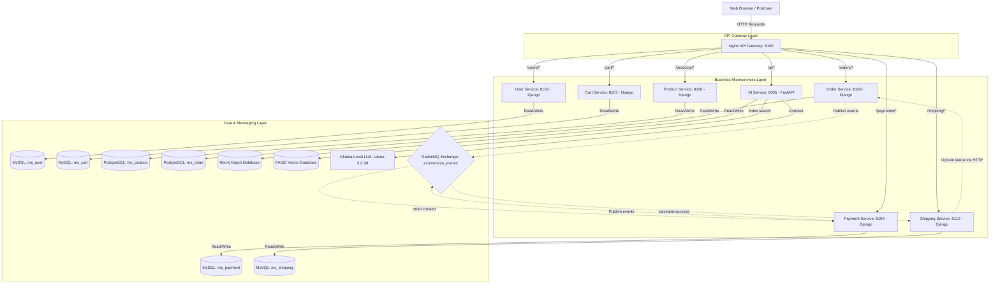
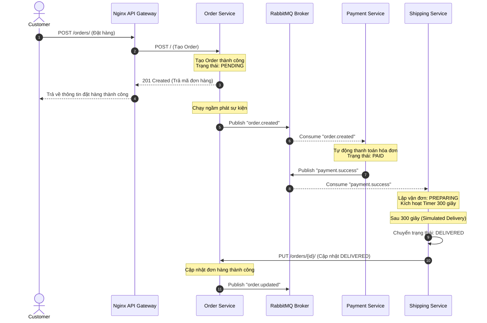

# MegaStore: Hệ thống E-Commerce Microservices tích hợp AI & Event-Driven Architecture

[](https://www.python.org/)
[](https://docs.djangoproject.com/)
[](https://fastapi.tiangolo.com/)
[](https://www.docker.com/)
[](https://www.rabbitmq.com/)
[](https://www.mysql.com/)
[](https://www.postgresql.org/)
[](https://neo4j.com/)
[](https://github.com/facebookresearch/faiss)

Hệ thống Thương mại Điện tử (E-Commerce) phân tán toàn diện được thiết kế theo nguyên lý **Domain-Driven Design (DDD)**, kiến trúc **Microservices** giao tiếp bất đồng bộ thông qua **RabbitMQ**, và được trang bị phân hệ trí tuệ nhân tạo **AI Service** (LSTM + Neo4j Graph + RAG Chatbot) để tối ưu hóa trải nghiệm cá nhân hóa khách hàng.

---

## 👥 THÔNG TIN SINH VIÊN thực hiện
*   **Họ và tên:** Trần Tuấn Cường
*   **Mã số sinh viên (MSSV):** B22DCVT073
*   **Lớp:** E22CNPM02
*   **Cơ sở đào tạo:** Học viện Công nghệ Bưu chính Viễn thông (PTIT)
*   **Năm học:** 2026

---

## 🏗️ Kiến trúc Tổng thể Hệ thống (System Architecture)

Hệ thống được tổ chức thành các phân lớp rõ rệt: **Presentation Layer**, **API Gateway Layer**, **Business Services Layer**, và **Data & Messaging Layer**.



### Các công nghệ cốt lõi
1.  **API Gateway (Nginx Proxy - Cổng 8100):** Đóng vai trò là cửa ngõ duy nhất tiếp nhận request từ Client, thực thi chính sách định tuyến (Reverse Proxy), che giấu cấu trúc cổng dịch vụ nội bộ và xử lý CORS.
2.  **User Service (Cổng 8102):** Đảm nhiệm việc quản lý tài khoản người dùng, phân loại nhóm quyền (Customer, Staff, Admin) bằng cơ chế RBAC và xử lý xác thực thông qua JWT token. Sử dụng cơ sở dữ liệu MySQL (`ms_user`).
3.  **Product Service (Cổng 8106):** Quản lý danh mục hàng hóa đa miền với 11 lớp thuộc tính đặc thù (Mobile, Computer, Clothes, Shoes, Watches, Cosmetics, Furniture, Kitchenware, Book, Sportswear, Accessories). Sử dụng cơ sở dữ liệu PostgreSQL (`ms_product`) để tận dụng tính năng lưu trữ JSON linh hoạt.
4.  **Cart Service (Cổng 8107):** Quản lý phiên mua sắm, giỏ hàng tạm thời của khách hàng. Sử dụng cơ sở dữ liệu MySQL (`ms_cart`).
5.  **Order Service (Cổng 8108):** Tiếp nhận yêu cầu mua hàng, tạo hóa đơn, quản lý vòng đời đơn hàng và tính tổng giá trị. Sử dụng PostgreSQL (`ms_order`).
6.  **Payment Service (Cổng 8109):** Xử lý giao dịch thanh toán (mặc định hỗ trợ COD). Sử dụng MySQL (`ms_payment`).
7.  **Shipping Service (Cổng 8110):** Điều phối lộ trình giao hàng, cập nhật các trạng thái (PREPARING, SHIPPED, DELIVERED). Sử dụng MySQL (`ms_shipping`).
8.  **AI Service (FastAPI - Cổng 8005):** Phân hệ độc lập cung cấp các API gợi ý sản phẩm thông minh và chatbot hỗ trợ tư vấn.
9.  **Message Broker (RabbitMQ):** Điều phối luồng xử lý bất đồng bộ, event-driven đảm bảo tính lỏng lẻo (loose coupling) và nâng cao khả năng chịu lỗi (fault tolerance).

---

## 🗄️ Thiết kế Cơ sở Dữ liệu & Bounded Context (DDD)

Hệ thống tuân thủ nghiêm ngặt nguyên tắc **Database-per-service** để tránh tranh chấp tài nguyên và đảm bảo tính đóng gói dữ liệu tuyệt đối (Information Hiding).

*   **MySQL (`ms_user`):** Lưu trữ bảng xác thực người dùng (`auth_user`), phân quyền nhóm (`auth_group`), và liên kết quyền hạn.
*   **MySQL (`ms_cart`):** Chứa các thực thể giỏ hàng (`cart_items`) liên kết khóa ngoại lỏng qua `product_id` (tham chiếu ID dạng số nguyên).
*   **MySQL (`ms_payment`):** Lưu trữ lịch sử giao dịch và trạng thái thanh toán (`payments`).
*   **MySQL (`ms_shipping`):** Lưu trữ trạng thái giao vận (`shipments`).
*   **PostgreSQL (`ms_product`):** Quản lý bảng sản phẩm dùng chung (`product_service_product`), bảng danh mục (`product_service_category`) và 11 bảng thuộc tính kế thừa đa hình (One-to-One với Product) cùng lịch sử giao dịch huấn luyện AI (`purchase_history`).
*   **PostgreSQL (`ms_order`):** Quản lý thực thể đơn hàng (`orders`) và chi tiết đơn hàng (`order_items`).

---

## 🔄 Luồng Hoạt động Hệ thống (System Workflows)

### 1. Luồng Thanh toán Đồng bộ (Synchronous Saga-like Checkout Flow)
Được điều phối trực tiếp bởi `user_service` để đảm bảo phản hồi tức thời cho khách hàng trên giao diện web:

1.  **Client** gửi yêu cầu thanh toán (POST `/users/customer/checkout/`) tới **Nginx Gateway**.
2.  Gateway định tuyến yêu cầu tới **User Service**.
3.  **User Service** thực hiện đóng gói dữ liệu và gọi REST API đồng bộ (POST) sang **Order Service** thông qua cổng nội bộ để tạo mới đơn hàng với trạng thái `PENDING`.
4.  Ngay sau khi nhận phản hồi thành công từ Order Service, **User Service** gọi tiếp POST sang **Payment Service** để lập hóa đơn nháp.
5.  Cuối cùng, **User Service** gọi POST sang **Shipping Service** để khởi tạo vận đơn cho đơn hàng.
6.  Nếu tất cả các bước thành công, **User Service** đồng bộ lịch sử mua sắm sang phân hệ AI (Product Service `PurchaseHistory`) và trả kết quả thành công rực rỡ về cho Client.

### 2. Luồng Xử lý Sự kiện Bất đồng bộ (Asynchronous Event-Driven Flow)
Sử dụng RabbitMQ để xử lý luồng nghiệp vụ chạy ngầm, tăng tốc thời gian phản hồi hệ thống:



---

## 🧠 Phân hệ AI Service (FastAPI)

Phân hệ Trí tuệ Nhân tạo hoạt động độc lập trên cổng `8005`, kết hợp ba công nghệ tiên tiến nhất để tạo ra mô hình đề xuất lai (Hybrid Recommendation Model):

1.  **Mô hình Học sâu LSTM (Sequence Modeling):**
    *   Phân tích lịch sử chuỗi tương tác (VIEW, CLICK, ADD_TO_CART, PURCHASE) gần nhất của người dùng với kích thước cửa sổ trượt (sliding window) $K = 3$.
    *   Sử dụng mạng nơ-ron hồi tiếp hai chiều (**Bi-LSTM**) được xây dựng trên TensorFlow/Keras để dự đoán xác suất danh mục ngành hàng tiếp theo khách hàng quan tâm.
2.  **Đồ thị Tri thức Neo4j (Knowledge Graph):**
    *   Mô hình hóa dữ liệu dưới dạng mạng lưới liên kết thực thể đa chiều: các đỉnh node `(:User)`, `(:Product)`, `(:Category)` liên kết với nhau qua các cạnh tương tác `[:VIEW]`, `[:CLICK]`, `[:ADD_TO_CART]`, `[:PURCHASE]`.
    *   Hỗ trợ truy vấn Cypher thông minh để tìm sản phẩm tương đồng, sản phẩm thường được mua cùng nhau dựa trên hành vi của các nhóm khách hàng có cùng sở thích (Collaborative Filtering).
3.  **Hệ thống RAG (Retrieval-Augmented Generation) Chatbot:**
    *   Mã hóa toàn bộ thông tin mô tả sản phẩm thành các vector embedding 384 chiều bằng mô hình ngôn ngữ `paraphrase-multilingual-MiniLM-L12-v2`.
    *   Lập chỉ mục và tìm kiếm tương đồng ngữ nghĩa bằng thư viện **FAISS** siêu tốc trên RAM.
    *   Ghép nối ngữ cảnh sản phẩm tìm được vào Prompt Template chuẩn hóa để gửi sang mô hình ngôn ngữ lớn **Llama 3.2 3B Instruct** chạy trên **Ollama** nội bộ, ngăn ngừa hiện tượng "ảo giác" (hallucination) của AI.

---

## 📁 Cấu trúc Thư mục Dự án (Project Structure)

```text
kiemtra01/
├── api-gateway/            # Nginx API Gateway configuration
│   └── nginx.conf          # Định tuyến các endpoints microservices
├── user_service/           # Microservice Quản lý Người dùng (Django)
├── product_service/        # Microservice Quản lý Sản phẩm (Django)
├── cart_service/           # Microservice Quản lý Giỏ hàng (Django)
├── order_service/          # Microservice Quản lý Đơn hàng (Django)
├── payment_service/        # Microservice Quản lý Thanh toán (Django)
├── shipping_service/       # Microservice Quản lý Giao hàng (Django)
├── ai_service/             # Phân hệ Trí tuệ Nhân tạo (FastAPI)
│   ├── app.py              # Main API endpoints (/chat, /recommend, /segment)
│   ├── train_models.py     # Huấn luyện mô hình Bi-LSTM trên dữ liệu người dùng
│   ├── ingest_graph.py     # Import dữ liệu hành vi người dùng vào Neo4j
│   ├── data/               # Dữ liệu hành vi thô (data_user500.csv)
│   └── models/             # Lưu trữ models sau huấn luyện (*.keras, *.index)
├── docker-compose.yml      # Cấu hình container orchestrator cho 10+ services
├── mysql-init.sql          # Khởi tạo các database MySQL
├── postgres-init.sql       # Khởi tạo các database PostgreSQL
├── requirements.txt        # Thư viện Python dùng chung ở môi trường gốc
├── seed.py                 # Script nạp dữ liệu mẫu ban đầu
└── .gitignore              # Loại bỏ các file rác, file nhị phân khi đẩy lên GitHub
```

---

## 🔌 Danh sách Routes của API Gateway (Nginx)

Tất cả các dịch vụ đều được định tuyến tập trung qua API Gateway chạy tại địa chỉ `http://localhost:8100`:

| Prefix Route | Microservice Đích | Chức năng chính |
| :--- | :--- | :--- |
| `/users/staff/` | `user_service:8000` | Trang dành riêng cho nhân viên vận hành hệ thống |
| `/users/customer/`| `user_service:8000` | Trang dành cho khách hàng (Duyệt shop, giỏ hàng, thanh toán) |
| `/admin/` | `user_service:8000` | Giao diện quản trị hệ thống của Django Admin |
| `/system-admin/` | `user_service:8000` | Cổng quản trị phân quyền tối cao (System Admin Portal) |
| `/products/` | `product_service:8000` | Quản lý danh mục sản phẩm và đồng bộ mua sắm |
| `/cart/` | `cart_service:8000` | API giỏ hàng (Thêm, bớt, xem giỏ hàng) |
| `/orders/` | `order_service:8000` | Lập đơn hàng và cập nhật vòng đời vận đơn |
| `/payments/` | `payment_service:8000` | Lập hóa đơn và theo dõi lịch sử thanh toán |
| `/shipping/` | `shipping_service:8000` | Điều phối tiến độ giao hàng cho Logistic |
| `/ai/` | `ai_service:8005` | API AI Chatbot tư vấn ngữ cảnh, phân khúc VIP và đề xuất sản phẩm |

---

## 🚀 Hướng dẫn Triển khai & Cài đặt (Setup Guide)

### 📋 Yêu cầu hệ thống
*   Đã cài đặt **Docker** và **Docker Compose**.
*   **Ollama** đã chạy trên máy host (để sử dụng LLM Llama-3.2). Tải mô hình bằng lệnh:
    ```bash
    ollama pull hf.co/phamhai/Llama-3.2-3B-Instruct-Frog-Q4_K_M-GGUF:Q4_K_M
    ```

### 🛠️ Các bước triển khai bằng Docker Compose

#### Bước 1: Khởi động hệ thống containers
Mở terminal tại thư mục gốc của dự án và chạy lệnh sau để build và khởi chạy đồng thời tất cả các services (MySQL, PostgreSQL, RabbitMQ, Neo4j, Nginx và 7 Microservices):
```bash
docker-compose up -d --build
```
> [!NOTE]
> Đợi từ 1 - 2 phút để các cơ sở dữ liệu hoàn thành quá trình khởi tạo sức khỏe (healthy status). Bạn có thể kiểm tra trạng thái bằng lệnh `docker ps`.

#### Bước 2: Nạp dữ liệu mẫu cho cơ sở dữ liệu Product
Để nạp dữ liệu mẫu ban đầu của 10+ dòng sản phẩm (Mobile, Computer, Clothes...) vào cơ sở dữ liệu PostgreSQL của Product Service, chạy script seed:
```bash
docker-compose exec product python product_service/seed.py
```

#### Bước 3: Nạp dữ liệu đồ thị hành vi người dùng vào Neo4j
Chạy script `ingest_graph.py` để import danh sách hành vi tương tác lịch sử của 500 người dùng mẫu vào Neo4j Graph Database:
```bash
docker-compose exec ai_service python ingest_graph.py
```

#### Bước 4: Huấn luyện mô hình Bi-LSTM cho phân hệ AI
Để huấn luyện mô hình dự báo hành vi và xuất các file trọng số nhị phân (`model_best.keras` và `category_le.pkl`), chạy lệnh:
```bash
docker-compose exec ai_service python train_models.py
```
> [!TIP]
> Sau khi quá trình huấn luyện kết thúc, phân hệ AI FastAPI sẽ tự động nạp các tệp trọng số mới để phục vụ API đề xuất tức thời. Hãy khởi động lại container AI Service để nạp tệp index FAISS & mô hình mới nhất:
> ```bash
> docker-compose restart ai_service
> ```

#### Bước 5: Truy cập và Trải nghiệm hệ thống
*   **Giao diện Khách hàng (Customer Shop):** `http://localhost:8100/customer/shop/`
*   **Giao diện Nhân viên (Staff Dashboard):** `http://localhost:8100/staff/login/?next=/staff/dashboard/`
*   **Giao diện Neo4j Browser:** `http://localhost:7474` (Tài khoản: `neo4j` / `password`)

---

